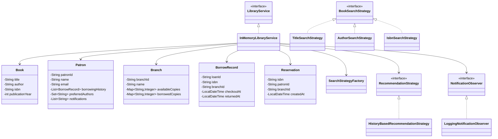

# Library Management System

An in-memory **Library Management System** implemented in Java to demonstrate:
1. OOP (encapsulation, abstraction, polymorphism)
2. SOLID-oriented design using service interfaces and focused domain models
3. Design patterns (Factory, Strategy, Observer)


## Features

### Core
1. **Book Management**
   - Add, update, remove books
   - Search by title, author, ISBN
2. **Patron Management**
   - Add and update patrons
   - Track borrowing history
3. **Lending Process**
   - Checkout books
   - Return books
4. **Inventory Management**
   - Track available and borrowed copies per branch

### Optional Extensions (Implemented)
1. **Multi-branch support**
   - Add/update branches
   - Transfer copies between branches
2. **Reservation system**
   - Reserve checked-out books
   - Notify patrons when copies become available
3. **Recommendation system**
   - Suggest available books based on borrowing history + preferred authors

## Design Patterns Used

1. **Strategy Pattern**
   - `BookSearchStrategy` (`TitleSearchStrategy`, `AuthorSearchStrategy`, `IsbnSearchStrategy`)
   - `RecommendationStrategy` (`HistoryBasedRecommendationStrategy`)
2. **Factory Pattern**
   - `SearchStrategyFactory` creates the right search strategy based on `SearchType`
3. **Observer Pattern**
   - `NotificationObserver` with `LoggingNotificationObserver` for reservation availability notifications

## Project Structure

```text
src/main/java/com/library/management/
  LibraryManagementSystemDemo.java
  model/
    Book.java
    BorrowRecord.java
    Branch.java
    Patron.java
    Reservation.java
  notification/
    NotificationObserver.java
    LoggingNotificationObserver.java
  recommendation/
    RecommendationStrategy.java
    HistoryBasedRecommendationStrategy.java
  search/
    SearchType.java
    BookSearchStrategy.java
    TitleSearchStrategy.java
    AuthorSearchStrategy.java
    IsbnSearchStrategy.java
    SearchStrategyFactory.java
  service/
    LibraryService.java
    InMemoryLibraryService.java
```

## Class Diagram



## Build and Run

Requirements:
1. Java 17+ (tested with Java 25)

Compile:
```bash
javac -d out $(find src/main/java -name "*.java")
```

Run demo:
```bash
java -cp out com.library.management.LibraryManagementSystemDemo
```

## Logging

Important events and errors are logged using Java's `java.util.logging`.
